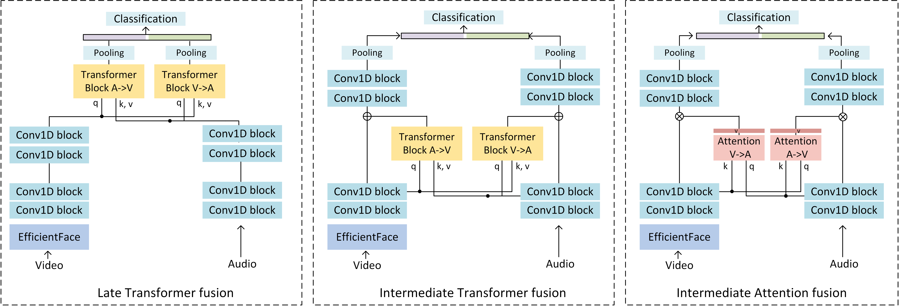

# Transformer-Based Multimodal Emotion Recognition

## Overview
This project focuses on recognizing human emotions by combining facial expressions and vocal intonations using transformer-based multimodal fusion techniques. Leveraging the RAVDESS dataset, the system implements three fusion mechanisms to effectively integrate audio and visual modalities, enabling robust and accurate emotion recognition.

## About
This repository implements a multimodal emotion recognition system based on the project *"Leveraging Facial and Vocal Cues for Emotion Recognition: A Transformer-Based Approach."* Using the RAVDESS dataset, we explore three fusion mechanisms to integrate audio and visual modalities: Late Transformer Fusion, Intermediate Transformer Fusion, and Intermediate Attention-Based Fusion. The goal is to recognize emotions by leveraging facial expressions and vocal intonations, both individually and in combination.

<p align="center">

</p>
<p align="center">
Fusion Mechanisms Overview
</p>

## Key Features
- Multimodal fusion leveraging transformer-based architectures.
- Three fusion variants: Late Transformer, Intermediate Transformer, and Intermediate Attention-Based Fusion.
- Preprocessing steps tailored for the RAVDESS dataset.
- Evaluation metrics include top-1 and top-5 precision scores.
- State-of-the-art performance, with **Intermediate Attention-Based Fusion** achieving 33.96% Top-1 precision.

## Key Highlights
- **Best Performing Fusion Mechanism**: The Intermediate Attention-Based Fusion method outperforms the other fusion methods, achieving 33.96% in top-1 precision and 98.13% in top-5 precision.
- **Facial and Vocal Integration**: The model effectively integrates facial and vocal cues using transformer-based architectures to provide robust emotion recognition.
- **Dataset Flexibility**: Users can train and test on custom data by following simple dataset setup steps, enhancing the system's versatility.

## Setup

### Prerequisites
The following dependencies are required:
- Python 3.9.5
- PyTorch 1.9.0

To install the required packages, use the following command:
```bash
pip install -r requirements.txt
```

### RAVDESS Dataset
The RAVDESS dataset can be downloaded from [here](https://zenodo.org/record/1188976#.YkgJVijP2bh). Organize the data as follows:
```
RAVDESS
└───ACTOR01
│   │  01-01-01-01-01-01-01.mp4
│   │  03-01-01-01-01-01-01.wav
└───ACTOR02
└───...
└───ACTOR24
```

### Preprocessing
To prepare the dataset, run the preprocessing scripts:
1. Extract facial regions using `extract_faces.py`.
2. Extract audio features using `extract_audios.py`.
3. Generate annotations using `create_annotations.py`.

```bash
cd ravdess_preprocessing
python extract_faces.py
python extract_audios.py
python create_annotations.py
```
Ensure that paths to data are correctly specified in each script.

## Usage

### Training the Model
1. Initialize visual features with EfficientFace pretrained on AffectNet ([download here](https://github.com/zengqunzhao/EfficientFace)).
2. Train the model by selecting a fusion mechanism and specifying relevant parameters:
```bash
python main.py --fusion [it | lt | ia] --mask [softhard | noise | nodropout] \
  --num_heads <NUM> --pretrain_path <PATH> --annotation_path <ANNOTATION_FILE>
```
- `--fusion`: Choose the fusion mechanism: `lt` for Late Transformer Fusion, `it` for Intermediate Transformer Fusion, and `ia` for Intermediate Attention-Based Fusion.
- `--mask`: Specify the dropout method: `softhard`, `noise`, or `nodropout`.
- `--num_heads`: Number of heads in the transformer model's fusion module.
- `--pretrain_path`: Path to the EfficientFace checkpoint.
- `--annotation_path`: Path to the annotations file.

### Testing the Model
To test a trained model without retraining, use the following command:
```bash
python main.py --no_train --no_val --result_path <RESULT_FOLDER>
```

### Using Your Own Data
To train or test the model on your own dataset:
1. Create a dataset class in `datasets/yourdataset.py`.
2. Add the dataset to `dataset.py`.
3. Specify the following options:
   - `--sample_size`: Image dimensions (e.g., 224).
   - `--sample_duration`: Temporal dimensions (e.g., 15).
   - `--n_classes`: Number of emotion classes.

## Results
Our experiments on the RAVDESS dataset demonstrated that the Intermediate Attention-Based Fusion mechanism achieved the best performance:
| Method                      | Top-1 Precision (%) | Top-5 Precision (%) |
|-----------------------------|---------------------|---------------------|
| Late Transformer Fusion     | 14.375              | 59.167              |
| Intermediate Transformer    | 13.958              | 85.208              |
| Intermediate Attention-Based| 33.958              | 98.125              |

## References
This work is built upon prior contributions:
- [EfficientFace](https://github.com/zengqunzhao/EfficientFace)
- [RAVDESS Dataset](https://smartlaboratory.org/ravdess/)
